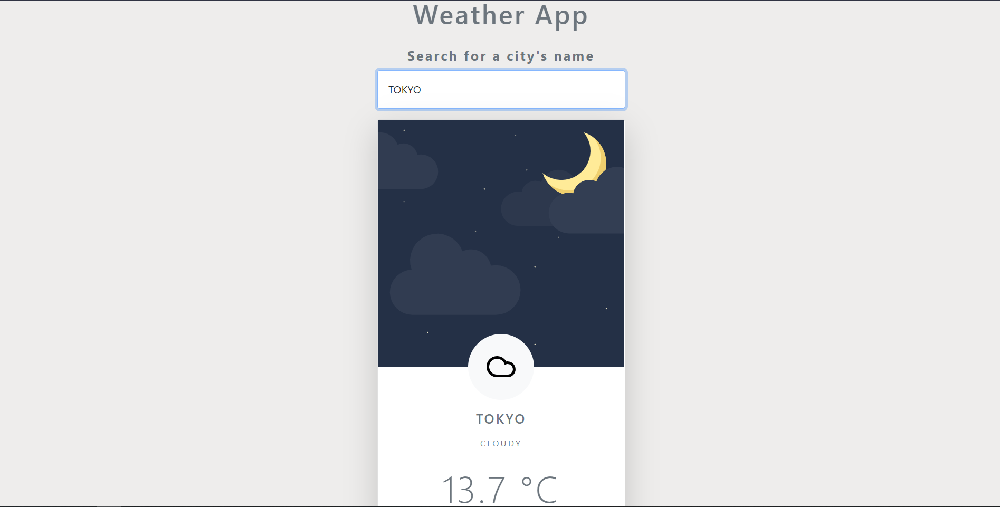

# Javascript Weather App

## Desctiption 

JavaScript Weather App is a weather application that allow users to check the current weather of a city by its name!

This application use a third api from [AccuWether](https://developer.accuweather.com/). So if you want to download or clone this repo and test it yourself, you must create an account at [AccuWether.com](https://developer.accuweather.com/) and use the API KEY that you receve when you create a new project!

## What I learned

How to use asynchronous JavaScript with promise and fetch api with async and await from fetch data from third API!